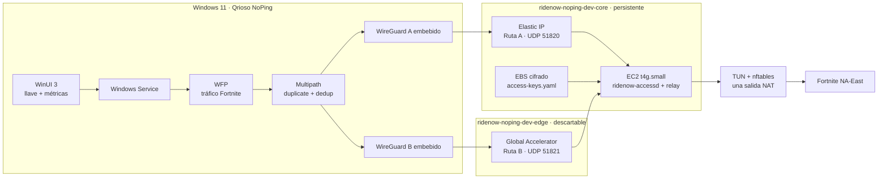

# Qrioso NoPing

MVP personal para optimizar y medir la ruta de Fortnite NA-East mediante dos túneles cifrados y duplicación/deduplicación real de paquetes. El producto se llama **Qrioso NoPing**; todos los recursos de AWS usan el prefijo configurable `ridenow-`.

> Estado real: están implementados CDK, ciclo de encendido/apagado, CLI de llaves, autorización HTTPS básica, deduplicador, UI WinUI, Windows Service y empaquetado local para Windows. Todavía faltan el data plane TUN/WireGuard/WFP, DPAPI, revocación activa de peers y el instalador firmado; el build Windows actual es de desarrollo, no un NoPing funcional.

## Arquitectura



La arquitectura completa y los flujos de llaves están en [docs/architecture.md](docs/architecture.md).

## Requisitos en macOS

- Docker Desktop iniciado.
- AWS CLI autenticado para `ridenow-main`.
- Git y `make`.

No instales Node.js, CDK, Go, .NET, WinUI ni SDKs de Windows directamente en macOS. CDK, Go y las pruebas compartidas .NET se ejecutan dentro de Docker.

## Configuración inicial

```bash
cp .env.example .env
aws sso login --profile ridenow-main
make aws-verify
```

Configuración predeterminada:

```dotenv
PROJECT_PREFIX=ridenow
STAGE=dev
AWS_PROFILE=ridenow-main
AWS_REGION=us-east-1
AWS_ACCOUNT_ID=009160027850
INSTANCE_TYPE=t4g.small
RELAY_AMI_ID=ami-068e33c5263812a9b
MAX_CLIENTS=10
MONTHLY_BUDGET_USD=60
```

Los scripts abortan si la cuenta autenticada no coincide con `AWS_ACCOUNT_ID`. `PROJECT_PREFIX` debe usar minúsculas, números o guiones y tener entre 2 y 20 caracteres. Para este entorno se mantiene `ridenow`.

## Ciclo diario de la infraestructura

### Encender o crear todo

```bash
make infra-up
```

Este único comando:

1. verifica que `ridenow-main` corresponda a la cuenta `009160027850`;
2. crea `ridenow-noping-dev-core` si todavía no existe;
3. enciende la EC2 si estaba detenida;
4. espera que la instancia y sus status checks estén correctos;
5. crea o actualiza `ridenow-noping-dev-edge` con Global Accelerator;
6. imprime los endpoints de las rutas A y B.

En el primer uso equivale al despliegue inicial. En usos posteriores no modifica el core: únicamente recupera la EC2 y recrea edge. Esto evita que un encendido diario reemplace accidentalmente la instancia que contiene las llaves.

### Apagar cuando no se está jugando

```bash
make infra-down
```

Este comando:

1. apaga la EC2 y espera el estado `stopped`;
2. elimina por completo el stack `edge` y Global Accelerator;
3. conserva VPC, EBS, Elastic IP, IAM, alarmas, budget y el archivo de llaves.

Global Accelerator se elimina porque AWS cobra la tarifa fija aunque el acelerador solo esté deshabilitado. Al volver a ejecutar `make infra-up`, el acelerador se recrea y puede recibir DNS/IP diferentes. La aplicación debe obtener el endpoint acelerado de una sesión nueva y nunca dejarlo fijado permanentemente.

Mientras está abajo no se cobra cómputo de la EC2. Persisten cargos pequeños de EBS, Elastic IP/IPv4 pública y servicios de monitoreo. AWS documenta que EBS y la Elastic IP permanecen al detener una instancia, mientras Global Accelerator cobra hasta que el acelerador es eliminado.

### Consultar estado

```bash
make infra-status
```

Muestra stack core, estado real de EC2, Elastic IP, stack edge y DNS de Global Accelerator.

### Aplicar cambios deliberados al core

El encendido diario no actualiza el core. Después de revisar `make infra-diff`, una actualización deliberada se ejecuta con confirmación exacta:

```bash
CONFIRM_UPDATE=ridenow-noping-dev-core make infra-update
```

La AMI ARM64 está fijada por `RELAY_AMI_ID` para impedir reemplazos silenciosos al publicarse una AMI nueva. Cambiar la AMI puede reemplazar la EC2 y perder el archivo de llaves; debe tratarse como una migración.

### Eliminar absolutamente todo

Esto elimina también EBS y `/etc/ridenow-noping/access-keys.yaml`; no es el apagado diario:

```bash
CONFIRM_DESTROY=ridenow-noping-dev make infra-destroy
```

Después de esta operación `make infra-up` crea una infraestructura nueva y vacía.

## Revisión de CDK

```bash
make infra-synth
make infra-diff
```

La infraestructura usa dos stacks y no requiere `CDKToolkit` porque actualmente no publica assets CDK:

- `ridenow-noping-dev-core`: VPC pública sin NAT Gateway, `t4g.small` ARM64, EBS gp3 cifrado, EIP, SSM, IAM, alarmas y budget;
- `ridenow-noping-dev-edge`: Global Accelerator, listener UDP 51821 y endpoint hacia la EC2.

El Security Group abre UDP 51820, UDP 51821, HTTPS 8443 y health check HTTP 8080. No existe SSH público. Tampoco se crean Cognito, Lambda, API Gateway, DynamoDB ni SQS.

## Relay y llaves

Probar y generar los binarios Linux ARM64:

```bash
make relay-test
make relay-build
```

Salida:

```text
dist/relay-linux-arm64/ridenow-token
dist/relay-linux-arm64/ridenow-accessd
dist/relay-linux-arm64/ridenow-relay
```

Una vez instalados en la EC2:

```bash
sudo ridenow-token add --id cliente-001 --note "PC de prueba"
sudo ridenow-token list
sudo ridenow-token validate
sudo ridenow-token revoke cliente-001
```

La llave completa se muestra una vez. `/etc/ridenow-noping/access-keys.yaml` guarda solamente su hash SHA-256, estado, límite de dispositivos y nota. La actualización del archivo es atómica.

Para registrar una llave creada manualmente sin mostrarla en los argumentos del proceso:

```bash
sudo RIDENOW_TOKEN='qnp_cliente-001_...' ridenow-token add --id cliente-001
```

## Compilar en la PC Windows

No existe compilación remota ni workflow de GitHub. Copia o clona el repositorio en una PC Windows 11 x64 que tenga:

- Visual Studio con desarrollo de escritorio .NET;
- WinUI/Windows App SDK;
- Windows 11 SDK;
- .NET SDK 10.

Desde PowerShell, en la raíz del repositorio:

```powershell
Set-ExecutionPolicy -Scope Process Bypass
.\build-windows.ps1
```

El script ejecuta las pruebas y produce:

```text
dist\windows\QriosoNoPing-win-x64\app\Qrioso NoPing.exe
dist\windows\QriosoNoPing-win-x64.zip
```

El ZIP incluye la aplicación, el Windows Service, `install.ps1` y `uninstall.ps1`. Para este build de desarrollo, descomprime el ZIP y ejecuta `install.ps1` como Administrador. El paquete todavía no contiene WireGuard/WFP.

Desde macOS solo se valida la lógica compartida:

```bash
make windows-check
```

## Flujo recomendado antes de jugar

```bash
aws sso login --profile ridenow-main
make infra-status
make infra-up
```

Al terminar:

```bash
make infra-down
make infra-status
```

## Comandos

```text
make aws-verify      Verifica perfil, cuenta, región y recursos existentes
make infra-synth     Genera ambos templates CloudFormation
make infra-diff      Compara ambos stacks con AWS sin crear change set
make infra-up        Crea/actualiza core, enciende EC2 y crea Global Accelerator
make infra-down      Apaga EC2 y elimina Global Accelerator conservando las llaves
make infra-status    Muestra el estado real de core, EC2 y edge
make infra-update    Actualiza core; exige CONFIRM_UPDATE exacto
make infra-destroy   Elimina todo; exige CONFIRM_DESTROY exacto
make relay-test      Ejecuta las pruebas Go dentro de Docker
make relay-build     Produce binarios Linux ARM64
make windows-check   Prueba el núcleo .NET dentro de Docker
```

## Límites del MVP

- Límite inicial: 10 PC simultáneas.
- La duplicación usa aproximadamente el doble del tráfico tunelizado.
- Con un solo ISP, las rutas comparten la última milla.
- AWS no garantiza reducir ping; se compararán directo, ruta A, ruta B y A+B.
- No se inyectará código en Fortnite ni se interferirá con Easy Anti-Cheat.

## Documentación

- [Objetivo permanente](AGENTS.md)
- [Plan del MVP](PLAN.md)
- [Arquitectura detallada](docs/architecture.md)

## Fuentes técnicas

- [AWS: costos al detener e iniciar EC2](https://docs.aws.amazon.com/AWSEC2/latest/UserGuide/how-ec2-instance-stop-start-works.html)
- [AWS: precio de Global Accelerator habilitado o deshabilitado](https://docs.aws.amazon.com/global-accelerator/latest/dg/introduction-pricing.html)
- [AWS CDK Developer Guide](https://docs.aws.amazon.com/cdk/v2/guide/home.html)
- [Microsoft: publicar aplicaciones Windows](https://learn.microsoft.com/en-us/windows/apps/package-and-deploy/)
