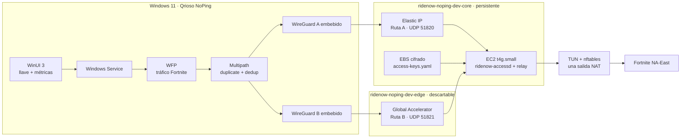

# Qrioso NoPing

MVP personal para optimizar y medir la ruta de Fortnite NA-East mediante dos túneles cifrados y duplicación/deduplicación real de paquetes. El producto se llama **Qrioso NoPing**; todos los recursos de AWS usan el prefijo configurable `ridenow-`.

> Estado real: el relay TUN/NAT, control de peers, revocación, multipath bidireccional, modos A/B/A+B, DPAPI, servicio Windows, UI y el source real WFP están implementados. `build-windows.ps1` descarga/compila automáticamente las DLL oficiales de WireGuard y el componente WFP. Una release distribuible todavía requiere catálogo Microsoft, certificado público de Qrioso y validación Windows/Easy Anti-Cheat; el propietario puede usar el modo `Test` no distribuible en una sola PC.

## Arquitectura



La arquitectura completa y los flujos de llaves están en [docs/architecture.md](docs/architecture.md).

## Requisitos en macOS

- Docker Desktop iniciado.
- AWS CLI autenticado para `ridenow-main`.
- Git y `make`.

No instales Node.js, CDK, Go, .NET, WinUI ni SDKs de Windows directamente en macOS. CDK, Go y las pruebas compartidas .NET se ejecutan dentro de Docker.

## Configuración inicial

```bash
cp .env.example .env
aws sso login --profile ridenow-main
make aws-verify
```

Configuración predeterminada:

```dotenv
PROJECT_PREFIX=ridenow
STAGE=dev
AWS_PROFILE=ridenow-main
AWS_REGION=us-east-1
AWS_ACCOUNT_ID=009160027850
INSTANCE_TYPE=t4g.small
RELAY_AMI_ID=ami-068e33c5263812a9b
MAX_CLIENTS=10
MONTHLY_BUDGET_USD=60
BUDGET_EMAIL=alertas@tu-dominio.com
```

`BUDGET_EMAIL` es obligatorio y debe ser un buzón real: recibe los umbrales del presupuesto y la solicitud de confirmación de SNS para alarmas de CPU/estado. Los scripts abortan si prefijo, perfil, cuenta o región no son exactamente `ridenow`, `ridenow-main`, `009160027850` y `us-east-1`.

## Ciclo diario de la infraestructura

### Encender o crear todo

```bash
CONFIRM_DEPLOY=ridenow-noping-dev-core make infra-up
```

La confirmación exacta solo se exige al crear el core por primera vez. Cuando el core ya existe, el encendido diario continúa siendo `make infra-up`.

Este único comando:

1. verifica que `ridenow-main` corresponda a la cuenta `009160027850`;
2. sintetiza y muestra el diff inmediatamente antes de cada deploy;
3. crea `ridenow-noping-dev-core` si todavía no existe y activa termination protection;
4. enciende la EC2 si estaba detenida;
5. espera que la instancia y sus status checks estén correctos;
6. crea o actualiza `ridenow-noping-dev-edge` con Global Accelerator;
7. compila el relay ARM64 en Docker, lo instala por SSM desde un artefacto S3 privado y efímero, configura los endpoints vigentes, verifica ambos servicios e imprime el pin SPKI público del certificado TLS;
8. imprime los endpoints de las rutas A y B.

En el primer uso equivale al despliegue inicial. En usos posteriores no modifica el core: únicamente recupera la EC2 y recrea edge. Esto evita que un encendido diario reemplace accidentalmente la instancia que contiene las llaves.

### Apagar cuando no se está jugando

```bash
make infra-down
```

Este comando:

1. apaga la EC2 y espera el estado `stopped`;
2. elimina por completo el stack `edge` y Global Accelerator;
3. conserva VPC, EBS, Elastic IP, IAM, alarmas, budget y el archivo de llaves.

Global Accelerator se elimina porque AWS cobra la tarifa fija aunque el acelerador solo esté deshabilitado. Al volver a ejecutar `make infra-up`, el acelerador se recrea y puede recibir DNS/IP diferentes. La aplicación debe obtener el endpoint acelerado de una sesión nueva y nunca dejarlo fijado permanentemente.

Mientras está abajo no se cobra cómputo de la EC2. Persisten cargos pequeños de EBS, Elastic IP/IPv4 pública y servicios de monitoreo. AWS documenta que EBS y la Elastic IP permanecen al detener una instancia, mientras Global Accelerator cobra hasta que el acelerador es eliminado.

### Consultar estado

```bash
make infra-status
```

Muestra stack core, estado real de EC2, Elastic IP, stack edge y DNS de Global Accelerator.

### Aplicar cambios deliberados al core

El encendido diario no actualiza el core. Después de revisar `make infra-diff`, una actualización deliberada se ejecuta con confirmación exacta:

```bash
CONFIRM_UPDATE=ridenow-noping-dev-core make infra-update
```

La AMI ARM64 está fijada por `RELAY_AMI_ID` para impedir reemplazos silenciosos al publicarse una AMI nueva. Cambiar la AMI puede reemplazar la EC2 y perder el archivo de llaves; debe tratarse como una migración.

### Eliminar absolutamente todo

Esto elimina también EBS y `/etc/ridenow-noping/access-keys.yaml`; no es el apagado diario:

```bash
CONFIRM_DESTROY=ridenow-noping-dev make infra-destroy
```

Después de esta operación `make infra-up` crea una infraestructura nueva y vacía.

## Revisión de CDK

```bash
make infra-synth
make infra-diff
```

La infraestructura usa dos stacks y no requiere `CDKToolkit`: el instalador del relay usa un bucket privado del core y elimina el objeto transitorio al terminar.

- `ridenow-noping-dev-core`: VPC pública sin NAT Gateway, `t4g.small` ARM64, EBS gp3 cifrado, EIP, SSM, bucket temporal de releases, SNS, alarmas y budget;
- `ridenow-noping-dev-edge`: Global Accelerator, listener UDP 51821 y endpoint hacia la EC2.

El Security Group abre UDP 51820, UDP 51821, HTTPS 8443 y health check HTTP 8080. No existe SSH público. Tampoco se crean Cognito, Lambda, API Gateway, DynamoDB ni SQS.

## Relay y llaves

Probar y generar los binarios Linux ARM64:

```bash
make relay-test
make relay-build
```

Salida:

```text
dist/relay-linux-arm64/ridenow-token
dist/relay-linux-arm64/ridenow-accessd
dist/relay-linux-arm64/ridenow-relay
```

Una vez instalados en la EC2:

```bash
sudo ridenow-token add --id cliente-001 --note "PC de prueba"
sudo ridenow-token list
sudo ridenow-token validate
sudo ridenow-token revoke cliente-001
```

La llave completa se muestra una vez. `/etc/ridenow-noping/access-keys.yaml` guarda solamente su hash SHA-256, estado, límite de dispositivos y nota. La actualización preserva `root:ridenow 0640`, usa reemplazo atómico y serializa la transacción completa para que altas y revocaciones concurrentes no se pisen.

Para registrar una llave creada manualmente sin mostrarla en los argumentos del proceso:

```bash
sudo RIDENOW_TOKEN='qnp_cliente-001_...' ridenow-token add --id cliente-001
```

## Compilar en la PC Windows

Para compilar e instalar el piloto con certificado local, consulta la [guía del componente WFP y Windows Test Mode](apps/windows/native/README.md#piloto-local-en-una-sola-pc).

No existe compilación remota ni workflow de GitHub. Copia o clona el repositorio en una PC Windows 11 x64 que tenga:

- Visual Studio con desarrollo de escritorio .NET;
- Desktop C++ x64 y WDK;
- WinUI/Windows App SDK;
- Windows 11 SDK;
- .NET SDK 10;
- Git for Windows y acceso de red para la primera preparación.

`build-windows.ps1` descarga `wireguard.dll`, compila `tunnel.dll` y compila el WFP automáticamente. En producción se reemplaza el catálogo generado por el devuelto por Microsoft, según la [documentación nativa de Windows](apps/windows/native/README.md). Desde PowerShell, en la raíz del repositorio:

```powershell
Set-ExecutionPolicy -Scope Process Bypass
.\build-windows.ps1 `
  -SigningCertificateThumbprint "<THUMBPRINT-CODE-SIGNING-QRIOSO>"
```

Para este piloto privado, `build-windows.ps1` lee automáticamente el `.env.infra` local y compila `AccessApiBaseUri`, `TlsSpkiPin` y `AccessToken` dentro de `Qrioso NoPing Service.exe`; la lista de ejecutables de Fortnite también está incorporada y la ruta nativa se calcula desde `Program Files`. El fichero está ignorado por Git, permanece al ejecutar `git pull` y no requiere argumentos. Las rutas y llaves WireGuard continúan obteniéndose dinámicamente al crear la sesión.

Para el piloto local, ejecuta en macOS:

```bash
make windows-command
```

El comando vigente, para copiar y pegar en PowerShell como Administrador desde la raíz del repositorio en Windows, es:

```powershell
$gitCommand = Get-Command git.exe -ErrorAction SilentlyContinue; $gitPath = if ($gitCommand) { $gitCommand.Source } else { $null }; if (-not $gitPath) { $winget = Get-Command winget.exe -ErrorAction SilentlyContinue; if (-not $winget) { throw "Git for Windows no está instalado y winget no está disponible." }; & $winget.Source install --id Git.Git --exact --source winget --scope machine --accept-source-agreements --accept-package-agreements; if ($LASTEXITCODE -ne 0) { throw "No se pudo instalar Git for Windows." }; $gitPath = Join-Path $env:ProgramFiles "Git\cmd\git.exe"; if (-not (Test-Path -LiteralPath $gitPath)) { throw "Git se instaló, pero no se encontró git.exe." } }; $env:Path = "$(Split-Path -Parent $gitPath);$env:Path"; & $gitPath pull --ff-only origin main; if ($LASTEXITCODE -ne 0) { throw "git pull falló." }; Set-ExecutionPolicy -Scope Process Bypass -Force; & ".\build-windows-pilot.ps1"
```

`make windows-command` imprime exactamente ese mismo comando. Si Git for Windows no existe, el comando lo instala mediante `winget`; después actualiza `main` y ejecuta el piloto. `build-windows-pilot.ps1` reutiliza o crea el certificado local de desarrollo, habilita Test Mode y ejecuta el build completo. En el primer arranque, el servicio registra automáticamente la llave compilada y guarda el estado con DPAPI.

Para el piloto exclusivo del propietario puede usarse `-DriverSigningMode Test` con Windows Test Mode y el certificado `Development`; ese ZIP no se distribuye.

El script ejecuta las pruebas y produce:

```text
dist\windows\QriosoNoPing-win-x64\app\Qrioso NoPing.exe
dist\windows\QriosoNoPing-win-x64.zip
```

El ZIP incluye la aplicación, el Windows Service, WireGuard embebido, WFP, instalador y desinstalador. Todos los ejecutables se verifican, el manifiesto SHA-256 está firmado y la instalación hace staging y rollback completo si falla el driver o el servicio. Descomprime el ZIP y ejecuta `install.ps1` como Administrador.

Desde macOS solo se valida la lógica compartida:

```bash
make windows-check
```

## Flujo operativo de desarrollo

```bash
aws sso login --profile ridenow-main
make infra-status
# Solo la primera vez:
CONFIRM_DEPLOY=ridenow-noping-dev-core make infra-up
# Encendidos posteriores:
make infra-up
```

Al terminar:

```bash
make infra-down
make infra-status
```

## Comandos

```text
make aws-verify      Verifica perfil, cuenta, región y recursos existentes
make infra-synth     Genera ambos templates CloudFormation
make infra-diff      Compara ambos stacks con AWS sin crear change set
make infra-up        Crea core la primera vez, enciende EC2, crea edge e instala servicios
make infra-down      Apaga EC2 y elimina Global Accelerator conservando las llaves
make infra-status    Muestra el estado real de core, EC2 y edge
make infra-update    Actualiza core; exige CONFIRM_UPDATE exacto
make infra-destroy   Elimina todo; exige CONFIRM_DESTROY exacto
make relay-test      Ejecuta las pruebas Go dentro de Docker
make relay-build     Produce binarios Linux ARM64
make windows-check   Prueba .NET, compila el Windows Service y valida el staging del instalador en Docker
make windows-command Imprime el comando sin parámetros del piloto listo para pegar en Windows
```

## Límites del MVP

- Límite inicial: 10 PC simultáneas.
- La duplicación usa aproximadamente el doble del tráfico tunelizado.
- Con un solo ISP, las rutas comparten la última milla.
- AWS no garantiza reducir ping; la app permite comparar directo, ruta A, ruta B y A+B.
- No se inyectará código en Fortnite ni se interferirá con Easy Anti-Cheat.

## Documentación

- [Objetivo permanente](AGENTS.md)
- [Plan del MVP](PLAN.md)
- [Arquitectura detallada](docs/architecture.md)
- [Runbook de release](docs/release-runbook.md)
- [Modelo de seguridad](docs/security-model.md)

## Fuentes técnicas

- [AWS: costos al detener e iniciar EC2](https://docs.aws.amazon.com/AWSEC2/latest/UserGuide/how-ec2-instance-stop-start-works.html)
- [AWS: precio de Global Accelerator habilitado o deshabilitado](https://docs.aws.amazon.com/global-accelerator/latest/dg/introduction-pricing.html)
- [AWS CDK Developer Guide](https://docs.aws.amazon.com/cdk/v2/guide/home.html)
- [Microsoft: publicar aplicaciones Windows](https://learn.microsoft.com/en-us/windows/apps/package-and-deploy/)
