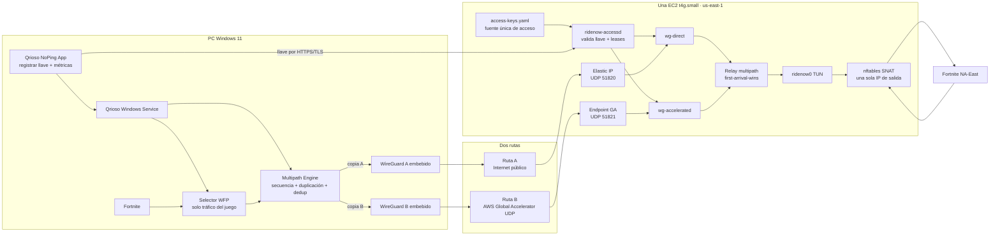
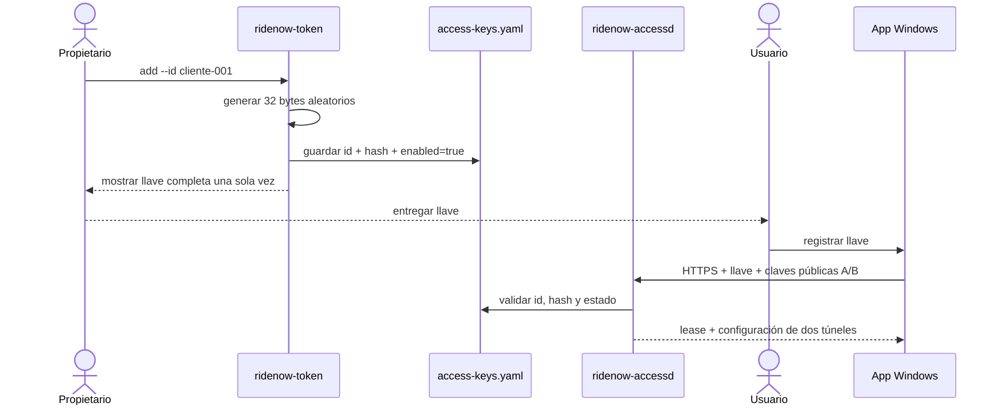
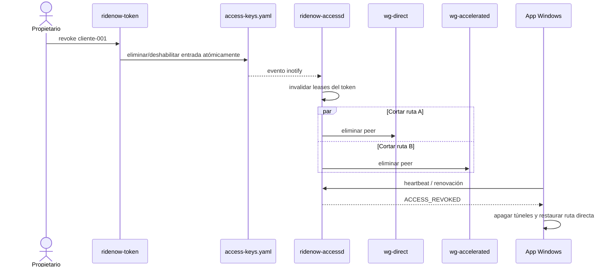
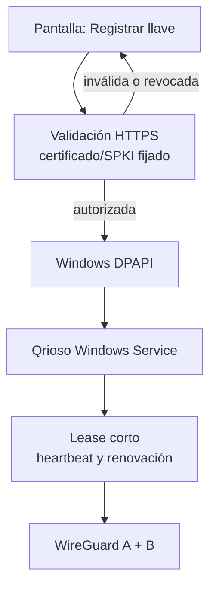
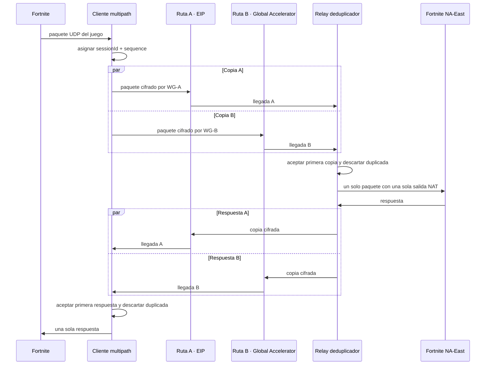
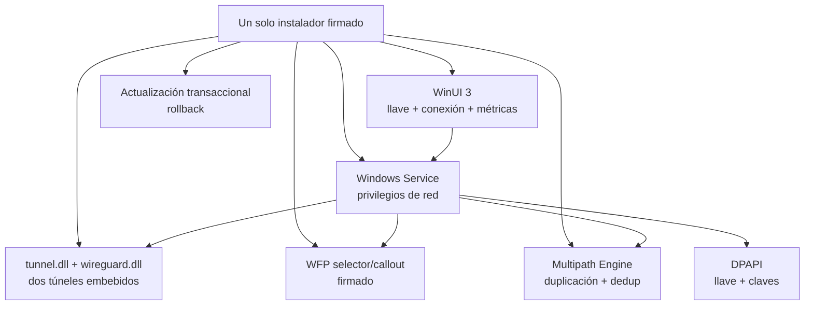
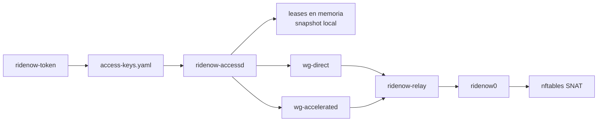
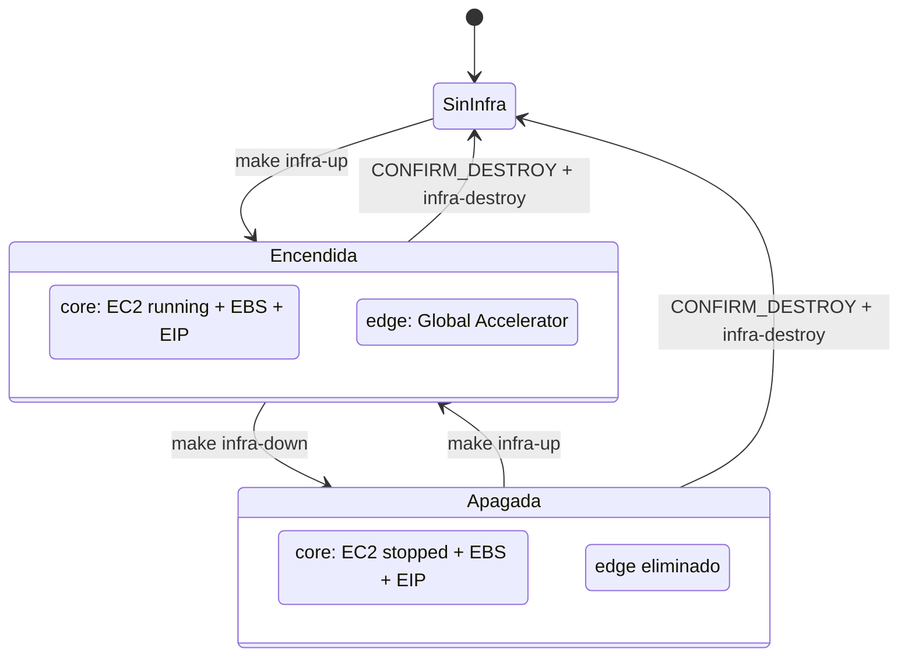
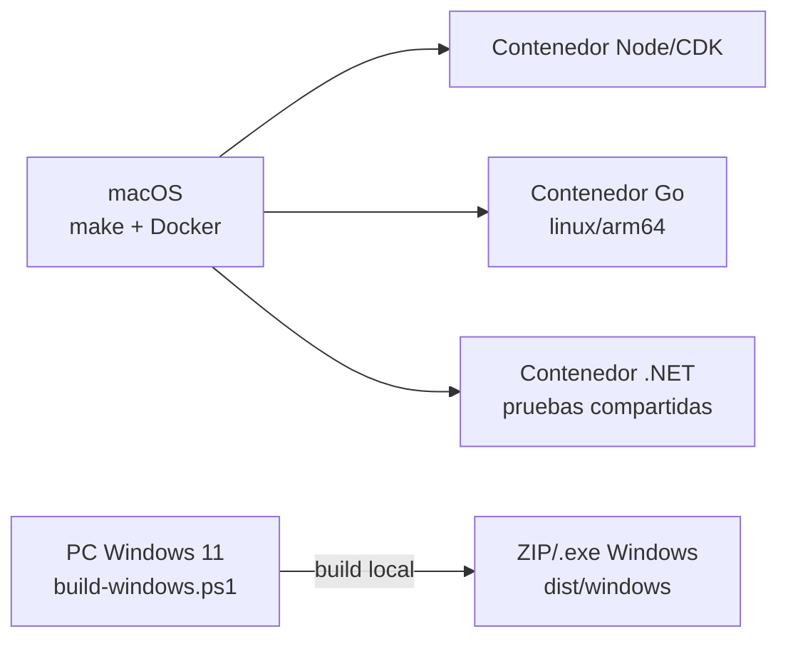

# Arquitectura de Qrioso NoPing

**Versión:** 0.6

**Fecha:** 28 de agosto de 2026

**Alcance:** MVP autocontenido para Windows, llave local, Fortnite NA-East, multipath y una EC2 en Virginia

El producto visible conserva el nombre Qrioso NoPing. En AWS, `PROJECT_PREFIX=ridenow` genera los stacks `ridenow-noping-dev-core` y `ridenow-noping-dev-edge`; todos los nombres físicos configurables comienzan con `ridenow-`.

## 1. Vista completa simplificada



No existen Cognito, Lambda, API Gateway, DynamoDB ni SQS. La autorización, los túneles y la revocación viven en la misma EC2.

## 2. Archivo de llaves

Ruta:

```text
/etc/ridenow-noping/access-keys.yaml
```

Ejemplo:

```yaml
version: 1
keys:
  cliente-001:
    tokenHash: "sha256:8f4c..."
    enabled: true
    maxDevices: 1
    note: "PC de prueba"

  cliente-002:
    tokenHash: "sha256:329a..."
    enabled: false
    maxDevices: 1
    note: "Acceso pausado"
```

- Permisos: `0640`.
- Propietario: `root:ridenow`.
- Se guarda el hash del secreto, no la llave completa.
- El ID permite localizar una entrada sin probar todos los hashes.
- El secreto debe contener al menos 32 bytes aleatorios.
- El archivo se actualiza mediante escritura temporal + `fsync` + rename atómico.

Formato entregado al usuario:

```text
qnp_cliente-001_<secreto-base64url>
```

## 3. Alta de una llave



El propietario también puede crear el valor por su cuenta:

```bash
sudo ridenow-token add --id cliente-001 --token 'qnp_cliente-001_...'
```

La app protege la llave con Windows DPAPI. No debe aparecer completa en logs, métricas, pantallas de error ni crash dumps.

## 4. Revocación inmediata



**Objetivo operativo:** que una llave eliminada pierda ambas rutas en 10 segundos o menos. El watcher hace el corte inmediato; el heartbeat es una confirmación y mecanismo de recuperación.

Después de reiniciar la EC2, `ridenow-accessd` reconstruirá los peers únicamente desde las llaves activas y leases válidos. Ningún peer huérfano debe sobrevivir una reconciliación.

## 5. Registro de la llave en Windows



La aplicación no necesita usuario ni contraseña. La llave representa la autorización. Si alguien copia la llave, podrá intentar usarla; por eso el archivo admite `maxDevices: 1`, el servicio registra dispositivos y el propietario puede revocarla en cualquier momento.

## 6. Flujo de un paquete multipath



### Qué puede y qué no puede mejorar

- El primer paquete que llegue gana; esto puede reducir p95, jitter y pérdida cuando una de las rutas se congestiona.
- No reduce la latencia física por debajo de la ruta más rápida.
- Con una sola conexión residencial, A y B comparten módem, ISP inicial y última milla antes de divergir.
- Enviar dos copias duplica aproximadamente el tráfico tunelizado y el trabajo de cifrado.
- El motor debe poder cambiar entre `direct`, `single-path` y `duplicate` para pruebas A/B y fallback.

## 7. Componentes dentro de la aplicación Windows



El usuario instala únicamente Qrioso NoPing. WireGuard se integra como librería/servicio interno y no aparece como requisito ni instalación separada. La instalación requerirá UAC porque crea un Windows Service y adaptadores/controladores de red.

## 8. Servicios dentro de la EC2



- `ridenow-accessd`: HTTPS, validación de llaves, dispositivos, leases, watcher y reconciliación.
- `ridenow-token`: CLI local para operaciones seguras y atómicas.
- `ridenow-relay`: secuencias, duplicación de respuestas y deduplicación.
- `wg-direct`: UDP 51820 por Elastic IP.
- `wg-accelerated`: UDP 51821 por Global Accelerator.
- Health responder TCP para Global Accelerator.
- SSM Session Manager, sin SSH público.
- CloudWatch con salud real de servicios, contadores ENA y alarmas de allowances.

El límite inicial será **10 PC simultáneas**. Solo se aumentará después de medir CPU, PPS, conntrack, ancho de banda y latencia de deduplicación.

## 9. Fallos y comportamiento seguro

- Archivo inválido: no aceptar nuevas conexiones, conservar un error visible y no aplicar una configuración parcial.
- Llave removida: revocar ambas rutas inmediatamente.
- `ridenow-accessd` reinicia: reconstruir únicamente peers autorizados.
- Heartbeat perdido: lease expira y peers se eliminan.
- Certificado no coincide con el pin: la app no transmite la llave.
- Relay o multipath falla: la app apaga Qrioso y restaura la ruta directa.
- Desinstalación/crash: eliminar filtros WFP y restaurar rutas.

## 10. Encendido y apagado económico



- `infra-up`: crea core si falta, inicia EC2, espera sus status checks y crea edge; no actualiza core diariamente.
- `infra-down`: detiene EC2 y elimina edge; conserva el disco y las llaves.
- `infra-status`: informa el estado real de ambos stacks y la instancia.
- `infra-update`: aplica cambios deliberados al core con confirmación exacta.
- `infra-destroy`: elimina ambos stacks y el EBS; requiere confirmación exacta.

Deshabilitar Global Accelerator no elimina su tarifa fija, por lo que el modo ahorro destruye únicamente el stack edge. Al recrearlo puede cambiar el endpoint acelerado. La ruta A conserva su Elastic IP; la ruta B se descubre en cada sesión.

La AMI del relay queda fijada mediante `RELAY_AMI_ID`; un encendido normal nunca toma automáticamente una AMI nueva ni reemplaza la instancia que conserva `access-keys.yaml`.

## 11. Compilación sin contaminar macOS



CDK, Go y las pruebas .NET compartidas corren en Docker sobre macOS. No hay compilación remota. XAML/WinUI, Windows Service y WFP/WDK se compilan en la PC Windows con `build-windows.ps1`.

## 12. Estado de implementación

- Implementado: CDK core/edge, ciclo de costo, SSM, budget, health checks reales, métricas ENA y alarmas.
- Implementado: llaves canónicas, YAML estricto, CLI atómico, HTTPS fijado, rate limiting, leases y revocación activa de ambos peers.
- Implementado: dos WireGuard del relay, TUN, `nftables` SNAT, framing bidireccional, probes, MTU, modos A/B/A+B y deduplicación acotada first-arrival-wins.
- Implementado: UI WinUI brandada, protocolo local, DPAPI con ACL, Windows Service, WireGuard embebible, motor multipath administrado y fallback directo.
- Implementado: instalador transaccional, manifiesto firmado, validación de catálogo y gate de release que impide paquetes incompletos o sin firma.
- Implementado en source: componente WFP x64 real (DLL/driver/INF), adquisición automática de `wireguard.dll`, build oficial fijado de `tunnel.dll` y flujos separados de firma Microsoft y prueba local.
- Bloqueo externo de release pública: compilar en Windows, obtener la firma Microsoft del catálogo y la firma Authenticode pública de Qrioso; luego ejecutar Driver Verifier, Secure Boot/HVCI, Easy Anti-Cheat, carga y partidas A/B. Para una prueba del propietario en una sola PC existe un modo `Test` explícito y no distribuible. Binarios y certificados no se guardan en Git.

## 13. Fuentes

- [WireGuard: Embeddable Tunnel Library](https://git.zx2c4.com/wireguard-windows/tree/embeddable-dll-service/README.md)
- [Microsoft: Windows Filtering Platform](https://learn.microsoft.com/en-us/windows/win32/fwp/windows-filtering-platform-start-page)
- [Microsoft: WFP Traffic Inspection Sample](https://learn.microsoft.com/en-us/samples/microsoft/windows-driver-samples/windows-filtering-platform-traffic-inspection-sample/)
- [AWS Global Accelerator: UDP health checks](https://docs.aws.amazon.com/global-accelerator/latest/dg/about-endpoint-groups-health-check-options.html)
- [AWS: Global Accelerator se cobra hasta eliminarlo](https://docs.aws.amazon.com/global-accelerator/latest/dg/introduction-pricing.html)
- [AWS: persistencia y costo al detener EC2](https://docs.aws.amazon.com/AWSEC2/latest/UserGuide/how-ec2-instance-stop-start-works.html)
